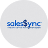

# SalesSync

<div align="center">
  
</div>

## Sobre o Projeto

**Este é meu projeto integrador do Senac**. O SalesSync é um sistema ERP (Enterprise Resource Planning) especializado em análise financeira e geração de relatórios detalhados, desenvolvido para atender pequenas e médias empresas. O sistema permite o gerenciamento completo de clientes, vendas, despesas e ordens de serviço, oferecendo uma visão clara do balancete empresarial em diferentes períodos (diário, semanal, mensal e anual).

O diferencial do SalesSync está na sua capacidade avançada de processamento de dados financeiros, gerando relatórios detalhados em formato CSV que incluem métricas essenciais como lucro bruto, impostos estimados, lucro líquido, total de vendas e despesas. Essas informações permitem ao gestor uma análise aprofundada do desempenho da empresa, facilitando a tomada de decisões estratégicas baseadas em dados concretos.

## Funcionalidades Principais

- **Gestão de Clientes**: Cadastro completo com código único, dados de contato e histórico de compras
- **Registro de Vendas**: Gerenciamento detalhado de vendas com múltiplos itens e cálculo automático
- **Controle de Despesas**: Categorização de gastos com suporte a despesas recorrentes e pontuais
- **Ordens de Serviço**: Emissão e acompanhamento com status, prazos e valores
- **Relatórios Financeiros**: Geração de balancetes em diferentes períodos (diário, semanal, mensal e anual)
- **Métricas Financeiras**: Cálculo automático de lucro bruto, impostos, lucro líquido e totalizadores
- **Controle de Acesso**: Três níveis de usuários (ADMIN, OWNER, EMPLOYEE) com permissões específicas
- **Interface Moderna**: Visual consistente e responsivo com FlatLaf em diferentes sistemas operacionais

<div align="center">
  <a href="doc/images/wireframes.pdf">Ver Wireframes</a>
</div>

## Tecnologias Utilizadas

- **Backend**: Java 17
- **Frontend**: Swing com FlatLaf 3.1 (Look and Feel moderno)
- **Persistência**: JPA/Hibernate 6.2
- **Banco de Dados**: MySQL 8.0
- **Arquitetura**: Padrão MVC (Model-View-Controller)
- **Segurança**: BCrypt para hash de senhas
- **Gerenciamento**: Maven para dependências

## Requisitos de Sistema

- Java 17 ou superior
- MySQL 8.0 ou superior
- 4GB de RAM (mínimo)
- 100MB de espaço em disco para a aplicação
- Sistemas Operacionais: Windows 10/11 ou distribuições Linux baseadas em Debian

## Instalação

### Pré-requisitos

- JDK 17+
- MySQL 8.0+
- Maven

### Passos para Instalação

1. Clone o repositório:
```bash
git clone https://github.com/seu-usuario/sales-sync-GUI.git
cd sales-sync
```

2. Configure o banco de dados:
```bash
mysql -u root -p < src/main/resources/db/script.sql
```

3. Configure as credenciais do banco de dados:
   - Edite o arquivo `src/main/resources/META-INF/persistence.xml` com as credenciais do seu banco de dados

4. Compile o projeto:
```bash
mvn clean package
```

5. Execute a aplicação:
```bash
java -jar target/salessync-1.0-SNAPSHOT.jar
```

## Perfis de Usuário

### Administrador (ADMIN)
- Configuração e manutenção do sistema
- Acesso aos logs do sistema para auditoria
- Gerenciamento de perfis de usuários
- Acesso a todos os relatórios

### Proprietário (OWNER)
- Acesso completo às funcionalidades operacionais
- Geração de relatórios detalhados em todos os períodos
- Acesso a métricas avançadas (lucro bruto, impostos, lucro líquido)
- Permissão para excluir registros do sistema

### Funcionário (EMPLOYEE)
- Operações diárias de vendas e atendimento
- Cadastro e edição de clientes
- Emissão de ordens de serviço
- Acesso limitado a relatórios diários

## Estrutura do Projeto

```plaintext
sales-sync/
└── src
    └── main
        ├── java
        │   └── br
        │       └── com
        │           └── devjf
        │               └── salessync
        │                   ├── SalesSyncApp.java                # Classe de chamada do programa
        │                   ├── controller                       # Controladores da aplicação
        │                   ├── dao                              # Camada de acesso a dados
        │                   ├── model                            # Entidades e modelos de dados
        │                   ├── service                          # Lógica de negócio
        │                   ├── util                             # Classes utilitárias
        │                   └── view                             # Interfaces gráficas
        └── resources
            ├── META-INF                                         # Configuração JPA
            ├── db                                               # Scripts SQL
            └── images                                           # Imagens e ícones
```

## Uso

### Login Inicial
- **Usuário**: admin
- **Senha**: @devjf123admin

### Principais Telas

1. **Login**: Validação de usuário e senha
2. **Dashboard**: Visão geral com indicadores principais do negócio
3. **Clientes**: Cadastro, consulta e histórico de clientes
4. **Vendas**: Registro, consulta e acompanhamento de vendas
5. **Despesas**: Controle e categorização de gastos
6. **Ordens de Serviço**: Emissão e acompanhamento de serviços
7. **Relatórios**: Geração de análises financeiras e operacionais
8. **Usuários**: Gerenciamento de usuários do sistema (ADMIN)
9. **Logs**: Registro de atividades para auditoria e segurança

## Relatórios Disponíveis

- **Balancete Diário**: Detalhamento de vendas e despesas do dia (todos os usuários)
- **Balancete Semanal**: Resumo semanal por categoria (OWNER e ADMIN)
- **Balancete Mensal**: Análise mensal de desempenho financeiro (OWNER e ADMIN)
- **Balancete Anual**: Comparativo anual com análise de tendências (OWNER e ADMIN)
- **Análise de Produtos**: Identificação de produtos com melhor desempenho de vendas

## Desenvolvimento

### Dependências Principais

- Hibernate ORM 6.2.7.Final
- Jakarta Persistence 3.1.0
- MySQL Connector 8.0.33
- FlatLaf 3.1.1 (Look and Feel)
- JBCrypt 0.4
- Apache Commons Lang 3.12.0
- JUnit Jupiter 5.9.3 (testes)

### Compilação

O projeto utiliza Maven para gerenciamento de dependências e build:

```bash
mvn clean install
```

## Diagramas

<div align="center">
  <p>Diagrama EER</p>
  
  
  <p>Diagrama UML</p>
  
</div>

## Contribuição

1. Faça um fork do projeto
2. Crie uma branch para sua feature (`git checkout -b feature/nova-funcionalidade`)
3. Commit suas mudanças (`git commit -m 'Adiciona nova funcionalidade'`)
4. Push para a branch (`git push origin feature/nova-funcionalidade`)
5. Abra um Pull Request

## Licença

Este projeto está licenciado sob a licença MIT - veja o arquivo LICENSE para detalhes.

## Contato

©DevJF - djfcoder@outlook.com
