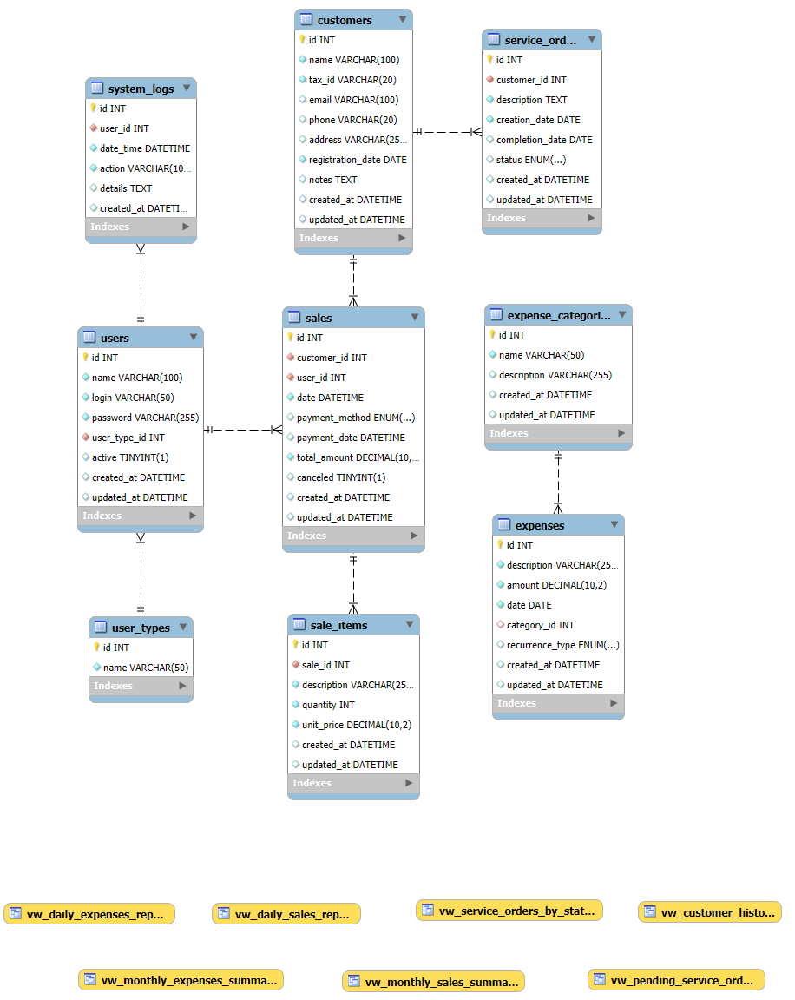
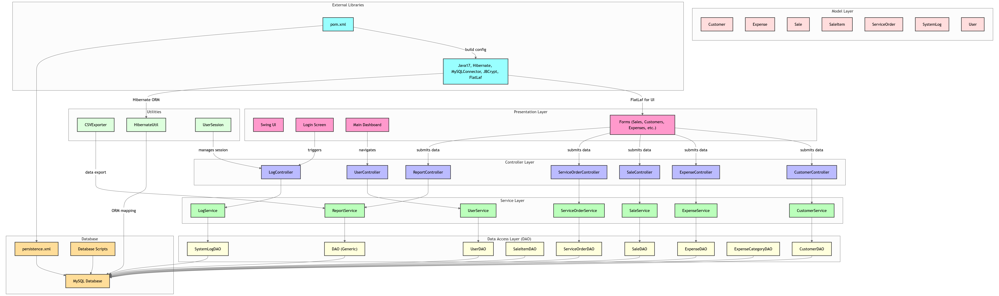

# SalesSync

## Sobre o Projeto

**Este é meu projeto integrador do Senac**. O SalesSync é um sistema de gestão de vendas e serviços desenvolvido para pequenos negócios. O sistema permite o controle de vendas, ordens de serviço, despesas e clientes, oferecendo uma solução completa para a gestão financeira e operacional do negócio.

## Funcionalidades

- **Gestão de Vendas**: Registro e acompanhamento de vendas, com suporte a diferentes métodos de pagamento
- **Ordens de Serviço**: Criação e gerenciamento de ordens de serviço com acompanhamento de status
- **Gestão de Clientes**: Cadastro completo de clientes com histórico de compras e serviços
- **Controle de Despesas**: Registro e categorização de despesas, com suporte a recorrências
- **Relatórios Financeiros**: Balanços diários, mensais e anuais para análise financeira
- **Controle de Acesso**: Diferentes níveis de acesso para administradores, proprietários e funcionários
- **Logs de Sistema**: Registro completo de atividades para auditoria e segurança
- **Gestão de Usuários**: Cadastro e ativação/desativação de usuários do sistema para o administrador

<div align="center">
  <a href="doc/images/wireframes.pdf">Wireframes</a>
</div>

## Tecnologias Utilizadas

- **Backend**: Java 17 com JPA/Hibernate 6.2
- **Frontend**: Swing com FlatLaf 3.1 (Look and Feel moderno)
- **Banco de Dados**: MySQL 8.0
- **Segurança**: BCrypt para hash de senhas
- **Ferramentas**: Maven para gerenciamento de dependências

## Requisitos de Sistema

- Java 17 ou superior
- MySQL 8.0 ou superior
- Mínimo de 4GB de RAM
- 100MB de espaço em disco para a aplicação

## Instalação

### Pré-requisitos

- JDK 17+
- MySQL 8.0+
- Maven

### Passos para Instalação

1. Clone o repositório:
```bash
git clone https://github.com/seu-usuario/sales-sync-GUI.git
cd sales-sync
```

2. Configure o banco de dados:

```bash
mysql -u root -p < src/main/resources/db/script.sql
```
3. Configure as credenciais do banco de dados em src/main/resources/META-INF/persistence.xml

4. Compile o projeto:

```bash
mvn clean package
```

5. Execute a aplicação:

```bash
java -jar target/salessync-1.0-SNAPSHOT.jar
```
---

## Estrutura do Projeto

```plaintext
sales-sync/
└── src
    └── main
        ├── java
            └── br
            │   └── com
            │       └── devjf
            │           └── salessync
            │               ├── SalesSyncApp.java                # Classe de chamada do programa
            │               ├── controller                       # Controladores da aplicação
            │                   ├── CustomerController.java
            │                   ├── ExpenseController.java
            │                   ├── LogController.java
            │                   ├── ReportController.java
            │                   ├── SaleController.java
            │                   ├── ServiceOrderController.java
            │                   └── UserController.java
            │               ├── dao                              # Camada de acesso a dados
            │                   ├── CustomerDAO.java
            │                   ├── DAO.java
            │                   ├── ExpenseCategoryDAO.java
            │                   ├── ExpenseDAO.java
            │                   ├── SaleDAO.java
            │                   ├── SaleItemDAO.java
            │                   ├── ServiceOrderDAO.java
            │                   ├── SystemLogDAO.java
            │                   └── UserDAO.java
            │               ├── model                            # Entidades e modelos de dados
            │                   ├── Customer.java
            │                   ├── Expense.java
            │                   ├── ExpenseCategory.java
            │                   ├── PaymentMethod.java
            │                   ├── RecurrenceType.java
            │                   ├── Sale.java
            │                   ├── SaleItem.java
            │                   ├── ServiceOrder.java
            │                   ├── ServiceStatus.java
            │                   ├── SystemLog.java
            │                   ├── User.java
            │                   └── UserType.java
            │               ├── service                          # Lógica de negócio
            │                   ├── CustomerService.java
            │                   ├── ExpenseService.java
            │                   ├── LogService.java
            │                   ├── ReportService.java
            │                   ├── SaleService.java
            │                   ├── ServiceOrderService.java
            │                   └── UserService.java
            │               ├── util                             # Classes utilitárias
            │                   ├── CSVExporter.java
            │                   ├── HibernateUtil.java
            │                   └── UserSession.java
            │               └── view                             # Interfaces gráficas
            │                   ├── Login.form
            │                   ├── Login.java
            │                   ├── MainAppView.form
            │                   ├── MainAppView.java
            │                   └── forms
            │                       ├── CustomersForm.form
            │                       ├── CustomersForm.java
            │                       ├── DashboardForm.form
            │                       ├── DashboardForm.java
            │                       ├── ExpensesForm.form
            │                       ├── ExpensesForm.java
            │                       ├── LogsForm.form
            │                       ├── LogsForm.java
            │                       ├── ReportsForm.form
            │                       ├── ReportsForm.java
            │                       ├── SalesForm.form
            │                       ├── SalesForm.java
            │                       ├── ServiceOrdersForm.form
            │                       ├── ServiceOrdersForm.java
            │                       ├── UsersForm.form
            │                       ├── UsersForm.java
            │                       └── newobjectforms
            │                           ├── NewCustomerForm.form
            │                           ├── NewCustomerForm.java
            │                           ├── NewExpenseForm.form
            │                           ├── NewExpenseForm.java
            │                           ├── NewSaleForm.form
            │                           ├── NewSaleForm.java
            │                           ├── NewServiceOrderForm.form
            │                           ├── NewServiceOrderForm.java
            │                           ├── NewUserForm.form
            │                           └── NewUserForm.java
        └── resources
            ├── META-INF                    # Configuração JPA
                └── persistence.xml
            ├── db                          # Scripts SQL
                ├── db_engeering
                │   ├── data.sql
                │   ├── indexes.sql
                │   ├── init.sql
                │   ├── script.sql
                │   └── views.sql
                └── schema.sql
            └── images                      # Imagens e ícones
                ├── EllipsePermission.png
                ├── SalesSync-logo1.png
                └── SalesSync-logo2-small.png
```

---

## Uso

### Login Inicial

- Usuário : admin
- Senha : @devjf123admin

### Principais Telas

1. Login : Validação de usuário
2. Dashboard : Visão geral do negócio com indicadores principais
3. Vendas : Registro e consulta de vendas
4. Ordens de Serviço : Gerenciamento de serviços
5. Clientes : Cadastro e histórico de clientes
6. Despesas : Controle de gastos
7. Relatórios : Análises financeiras e operacionais
8. Usuários : Ajustes do sistema e usuários
9. Logs do Sistema : Lista de atividades e ações 

## Relatórios Disponíveis

- Balancete diário
- Balancete semanal
- Balancete mensal
- Balancete anual
- Análise de lucratividade

## Desenvolvimento

### Dependências Principais

- Hibernate ORM 6.2.7.Final
- Jakarta Persistence 3.1.0
- MySQL Connector 8.0.33
- FlatLaf 3.1.1 (Look and Feel)
- JBCrypt 0.4
- Apache Commons Lang 3.12.0
- JUnit Jupiter 5.9.3 (testes)

### Compilação

O projeto utiliza Maven para gerenciamento de dependências e build:

```bash
mvn clean install
```

## Contribuição

1. Faça um fork do projeto
2. Crie uma branch para sua feature ( git checkout -b feature/nova-funcionalidade )
3. Commit suas mudanças ( git commit -m 'Adiciona nova funcionalidade' )
4. Push para a branch ( git push origin feature/nova-funcionalidade )
5. Abra um Pull Request

## Licença

Este projeto está licenciado sob a licença MIT - veja o arquivo LICENSE para detalhes.

## Contato

©DevJF - djfcoder@outlook.com

## Diagrama

<div align="center">
  <p>EER</p>
    
  <p>UML</p>
    
</div>
